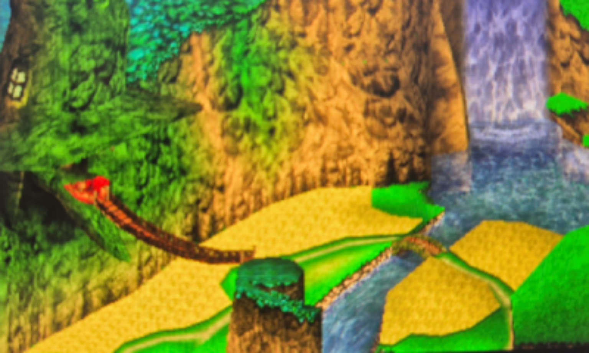

# Banjo3DS

**Banjo3DS is an experimental project working toward a native Nintendo 3DS
port of Banjo-Kazooie, built on the
[Banjo-Kazooie decompilation project](https://gitlab.com/banjo.decomp/banjo-kazooie).**

The current build is a Citro3D-based model viewer that renders Spiral
Mountain's opaque and translucent map geometry with an interactive debug
camera.

**Banjo3DS is not yet playable.**



*Spiral Mountain rendered by the current Banjo3DS build in Azahar.*

## Current status

Banjo3DS is currently focused on bringing the original game's data and
rendering pipeline to the Nintendo 3DS.

The host-side Python tools decode and convert a subset of Banjo-Kazooie's
Nintendo 64 model and display-list data at build time. The native 3DS target
renders the generated data using Citro3D.

Spiral Mountain is the main test scene. Its opaque (`14CF`) and translucent
(`14D0`) map geometry is exported and rendered as separate passes.

The original Banjo-Kazooie gameplay code is present in the repository as
part of the decompilation, but it is not yet connected to the 3DS target.
Gameplay, actors, collision, physics and game audio should therefore not
be considered implemented on 3DS yet.

## What works

The current Banjo3DS pipeline includes:

- Native Nintendo 3DS rendering using Citro3D and libctru
- Conversion of N64 model geometry to a 3DS-friendly vertex format
- Vertex positions, texture coordinates and vertex RGBA colors
- Support for the currently implemented subset of N64 display-list commands
- Texture decoding for CI4, CI8, RGBA16, RGBA32 and IA8
- Texture wrapping and sampling support used by the current test models
- Translation of currently supported N64 combiner configurations
- Batching of adjacent triangles with compatible render state while preserving order
- Separate opaque (OPA) and translucent (XLU) rendering passes
- Alpha blending for the current translucent geometry
- Per-draw culling state
- An interactive debug/orbit camera
- Spiral Mountain (`14CF` + `14D0`) as the current test scene
- Python regression tests for the model decoder and exporter

Several parts of the N64 graphics pipeline are still only partially
implemented. Rendering the current test scene does not imply complete
N64 rendering compatibility.

## Debug camera controls

The current build is a model viewer, so the controls manipulate the camera
rather than Banjo.

| Input | Action |
| --- | --- |
| Circle Pad | Orbit camera |
| L / R | Zoom out / in |
| D-Pad | Pan camera focus |
| X | Reset camera |
| START | Exit |

## Building the 3DS target

### Requirements

The current build expects:

- devkitPro / devkitARM
- libctru
- Citro3D
- make
- A Python virtual environment at `.venv`
- Extracted Banjo-Kazooie model assets

Run the commands below from the **repository root**, in an environment
configured for devkitPro's Nintendo 3DS toolchain, including `DEVKITARM`
and `CTRULIB`. The Makefile invokes `.venv/bin/python`.

If the virtual environment does not already exist:

```sh
python3 -m venv .venv
```

Prepare the required model assets first using the
[Original decompilation building instructions](docs/upstream-building.md).
That document also preserves the existing upstream dependency setup.
The 3DS build expects these files to exist:

```text
assets/model/14CF.model.bin
assets/model/14D0.model.bin
```

These files are not tracked by the repository. The current setup uses
assets extracted from the US v1.0 version of Banjo-Kazooie. The 3DS Makefile
does not perform the complete ROM extraction process itself.

### Build

Once the required model assets are present:

```sh
make -C platform/3ds
```

The build automatically generates:

```text
platform/3ds/source/generated_model.h
```

from the required model assets, then builds the Nintendo 3DS target.
The resulting build includes:

```text
platform/3ds/banjo3ds.elf
platform/3ds/banjo3ds.3dsx
```

### Tests

Run the decoder/exporter regression tests with:

```sh
.venv/bin/python -m unittest discover -s tools/banjo3ds/tests -v
```

Some regression tests load extracted model assets, so the complete suite
requires local game assets.

## Asset preparation

Banjo3DS does not track the extracted model assets used by the renderer.
The existing decompilation tooling starts from a user-supplied
Banjo-Kazooie ROM and extracts the game's assets:

```text
user-supplied Banjo-Kazooie ROM
        |
        v
decompression / ROM splitting
        |
        v
bin/assets.bin
        |
        v
bk_asset_tool
        |
        v
assets/model/*.model.bin
        |
        v
Banjo3DS decoder + exporter
        |
        v
generated_model.h
        |
        v
Citro3D renderer
```

The current 3DS Makefile expects the required model assets to have already
been generated. See the
[Original decompilation building instructions](docs/upstream-building.md)
for the existing ROM setup and extraction/build workflow.

## Technical overview

The Banjo3DS-specific tooling lives primarily under `tools/banjo3ds/`.
The native viewer and vertex shader live under `platform/3ds/`.

```text
N64 model.bin
     |
     v
n64_displaylist_decoder.py
     |  geometry, textures, render state
     v
export_3ds_model.py
     |  batching, texture conversion, 3DS render data
     v
generated_model.h
     |
     v
platform/3ds
     |
     v
Citro3D / PICA200
```

The exporter preserves triangle order while combining adjacent triangles
that use compatible state. The current renderer handles Spiral Mountain
as separate opaque and translucent passes and applies culling per draw.

This pipeline is still under development. It supports a subset of the
Nintendo 64 graphics pipeline used by the current test scene; some state and
ordering behavior remain unimplemented or approximate.

## Known limitations

Banjo3DS is a rendering and porting prototype rather than a playable game port.
Major limitations include:

- No playable Banjo-Kazooie gameplay on the 3DS target yet
- Actors and gameplay systems are not connected
- Collision and game physics are not connected
- Game audio is not connected
- Banjo player controls are not connected
- Incomplete geo-tree / SORT support
- Water animation is not implemented
- No general support for all maps
- Incomplete N64 display-list support
- Incomplete N64 combiner and render-mode emulation
- Incomplete N64 rendering accuracy

## Original Banjo-Kazooie decompilation

Banjo3DS is built on the work of the
[Banjo-Kazooie decompilation project](https://gitlab.com/banjo.decomp/banjo-kazooie).

That project reconstructed the original Banjo-Kazooie codebase and provides
the game code, ROM splitting, asset extraction and other tooling on which
this project builds.

Banjo3DS adds its experimental Nintendo 3DS target and tooling to translate
currently supported Nintendo 64 model/render data for the Citro3D renderer.

The original decompilation build information and ROM checksums are preserved
in [Original decompilation building instructions](docs/upstream-building.md).

## Credits

Banjo3DS would not be possible without the work of the Banjo-Kazooie
decompilation contributors and the projects and libraries used throughout
the repository.

The project builds on or uses dependencies including:

- The Banjo-Kazooie decompilation project
- devkitPro, libctru and Citro3D
- splat
- asm-differ
- asm-processor
- bk_asset_tool
- bk_rom_compressor
- ultralib

See the repository, its submodules and their respective license files and
notices for authorship and licensing information.

## License and game assets

The repository's root [LICENSE](LICENSE) contains the CC0 1.0 Universal dedication.

Dependencies and third-party components may have their own licenses and
notices. The root license should not be interpreted as applying to all
third-party software or to original Banjo-Kazooie game assets.

Extracted game assets and ROM files are not tracked as part of the
Banjo3DS source repository. Building the current viewer requires model
assets extracted from a user-supplied Banjo-Kazooie ROM.

Banjo-Kazooie and its original game content are the property of their
respective rights holders.
